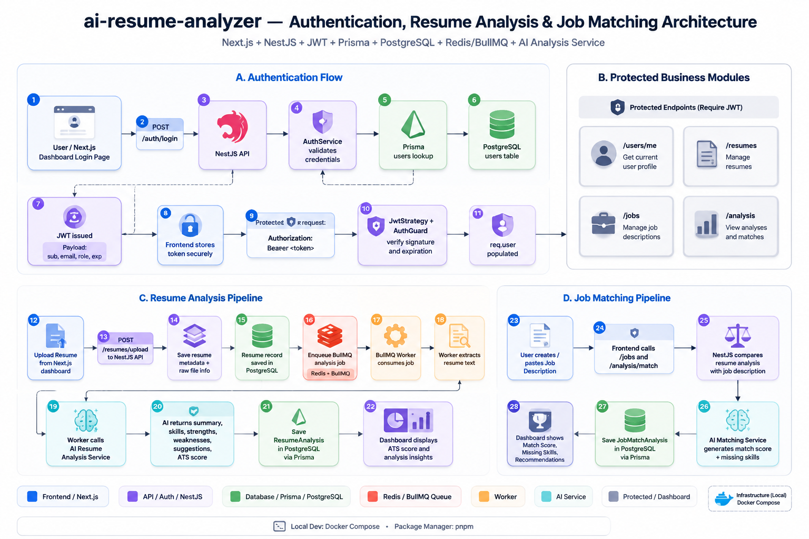

# AI Resume Analyzer

A full-stack AI-powered resume analyzer that helps users analyze resumes, calculate ATS scores, extract skills, and generate improvement insights.

## Preview



## Tech Stack

- Frontend: React
- Backend: NestJS + Prisma
- ML Service: FastAPI
- Database: PostgreSQL
- ORM: Prisma

## Features

- Upload and analyze resumes
- Extract resume skills and keywords
- Calculate ATS score
- Generate resume improvement insights
- Store analysis results in PostgreSQL
- Use a separate FastAPI ML service

## Project Structure
```text
ai-resume-analyzer/
|-- frontend/
|-- backend/
|-- ml-service/
|-- docker-compose.db.yml
|-- SAMPLE_DATA.md
`-- README.md

## Getting Started

### 1. Clone the repository

bash
git clone https://github.com/alirezanaseri548/ai-resume-analyzer.git
cd ai-resume-analyzer

### 2. Environment Variables

Create real `.env` files based on the example files:

text
backend/.env.example
frontend/.env.example
ml-service/.env.example

Do not commit real `.env` files.

### 3. Start PostgreSQL

bash
docker compose -f docker-compose.db.yml up -d

### 4. Setup Backend

bash
cd backend
npm install
npx prisma generate
npx prisma migrate dev
npm run seed
npm run start:dev

Default backend URL:

text
http://localhost:3000

### 5. Setup Frontend

bash
cd frontend
npm install
npm run dev

Default frontend URL:

text
http://localhost:5173

### 6. Setup ML Service

bash
cd ml-service
pip install -r requirements.txt
uvicorn main:app --host 0.0.0.0 --port 8000 --reload

Default ML service URL:

text
http://localhost:8000

## Sample Data

Sample data and seed instructions are available in:

text
SAMPLE_DATA.md
backend/prisma/schema.prisma
backend/prisma/seed.js
backend/prisma/seed.ts

## Security Notes

The following files should not be committed:

text
.env
.env.*
node_modules
dist
build
temporary files
backup files
runtime uploads

Use `.env.example` files for public configuration examples.

## Contributing

Contributions are welcome.

Please read `CONTRIBUTING.md` before opening a pull request.

## License

This project is licensed under the MIT License.
